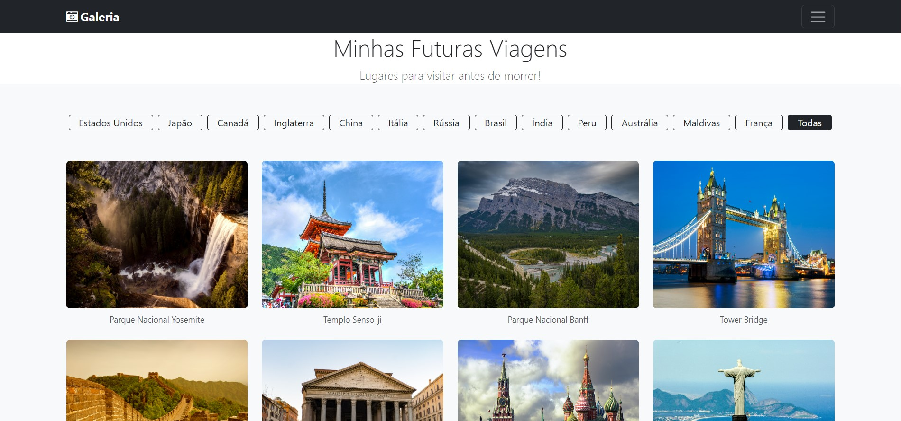

<h1 align="center"> Projeto Galeria </h1>

Esse é um Projeto que desenvolvi enquanto estava aprendendo a usar jQuery, bootstrap e webpack  

 

  

## 🚀 Tecnologias

Esse projeto foi desenvolvido com as seguintes tecnologias:

- Bootstrap
- jQuery
- Webpack
- JavaScript
- HTML e CSS
- Git e Github